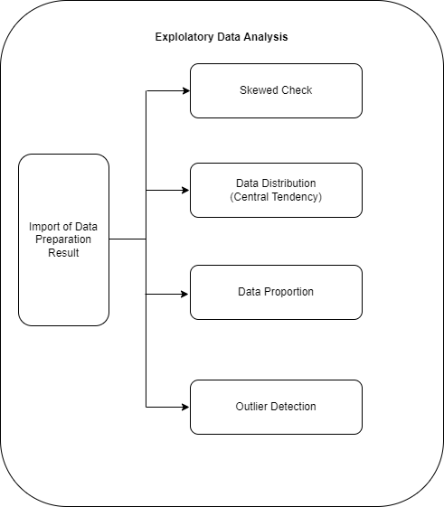

# Pengantar 

` Dokumentasi Program : https://medium.com/@prasetyow938/fraud-detection-in-online-transactions-using-machine-learning-2489fe0f8e48

## Cara menjalankan Script Dilokal

## Cara Melihat Dokumentasi Lengkap Program menggunakan MKDocs seperti gambar dibawah ini

## Konfigurasi Awal
- instalasi virtual environment
- aktifkan virtual environment yang telah dibuat
- install requirements.txt dengan cara `pip install -r requirements.txt`
- file sudah dikonfigurasi, lanjutkan step dibawah ini
- Pastikan sudah berada didalam folder `docs`
- ketik - `mkdocs serve --dev-addr=127.0.0.1:8080`
- lalu laman dokumen akan muncul pada laman `http://127.0.0.1:8080`
- Selamat membaca

## Cara Menjalankan API

- train ulang dulu untuk notebook dari 1.Data Preprartion hingg 4.Data Modeling.ipynb untuk mendapatkan modelnya, soalnya terlalu berat jika di upload
- Pastikan masuk ke folder utama program
- ketik - `python src/api.py`
- lalu akan dirujuk pada laman `http://127.0.0.1:8000`

##  Data Preparation

**Gambar Arsitektur Data Preparation**

### Data Definition
Data yang digunakan merupakan data yang menggambarkan identitas transaksi dan data transaksi yang memiliki label fraud dan tidak fraud. adapun fitur profile nasabah yang digunakan antara lain

Data berisi 590540 rows × 434 columns yaitu :

* TransactionID: ID unik untuk setiap transaksi.
* isFraud: Variabel target yang menandakan apakah transaksi tersebut merupakan fraud (penipuan) atau tidak fraud (penipuan).
* TransactionDT: Waktu transaksi dalam satuan detik sejak waktu awal (referensi).
* TransactionAmt: Jumlah transaksi dalam mata uang asli.
* ProductCD: Jenis produk yang digunakan dalam transaksi.
* card1 - card6: Informasi terkait kartu kredit seperti jenis, kategori, dan penerbit.
* addr1 - addr2: Informasi terkait alamat pelanggan.
* P_emaildomain dan R_emaildomain: Domain email pelanggan yang terkait dengan transaksi pengirim (P) atau penerima (R).
* C1 - C14: Fitur perhitungan yang berhubungan dengan kartu kredit.
* D1 - D15: Fitur perhitungan yang mencerminkan waktu antara transaksi.
* M1 - M9: Fitur kategorikal yang mengindikasikan kecocokan antara nama di kartu, alamat, dan alamat email.
* V1 - V339: Fitur-fitur yang dihasilkan oleh PCA dan berisi informasi terkait dengan transaksi.
* TransactionID: ID unik untuk setiap transaksi.
* id-01 hingga id-38: Fitur-fitur identitas yang mengandung informasi terkait dengan profil identitas pelanggan.
* DeviceType: Jenis perangkat yang digunakan oleh pelanggan saat melakukan transaksi.
* DeviceInfo: Informasi terkait dengan perangkat yang digunakan oleh pelanggan saat melakukan transaksi.
* id_12 - id_38: Fitur-fitur identitas tambahan yang memberikan informasi tambahan tentang profil identitas pelanggan.
    
## Exploratory Data Analysis (EDA)

**Gambar Arsitektur Exploratory Data Analysis (EDA)**

    

## Data Preprocessing

**Gambar Data Preprocessing**

## Data Modeling

**Gambar Arsitektur Data Modeling**

## Machine Learning Services

**Arsitektur Machine Learning Services**

Selanjutnya, setelah melalui beberapa proses dan model telah di save akan dilanjutkan pada deployment dengan menggunakan API dan Streamlit gambar dibawah ini merupakan contoh mengakses menggunakan ML Services melalui FAST API Swagger UI

Berikut contoh input data yang digunakan untuk mengakses API

Berikut hasil output prediksi dari API services

## Referensi

- Gölyeri, M., Çelik, S., Bozyiğit, F., & Kılınç, D. (2023). Fraud detection on e-commerce transactions using machine learning techniques. In _Artificial Intelligence Theory and Applications_ (Vol. 3, Issue 1). https://www.boyner.com.tr/

- Ileberi, E., Sun, Y., & Wang, Z. (2022). A machine learning based credit card fraud detection using the GA algorithm for feature selection. _Journal of Big Data_, _9_(1). https://doi.org/10.1186/s40537-022-00573-8

- Saputra, A. (2019). Fraud Detection using Machine Learning in e-Commerce. In _IJACSA) International Journal of Advanced Computer Science and Applications_ (Vol. 10, Issue 9). www.ijacsa.thesai.org

- https://towardsdatascience.com/step-by-step-approach-to-build-your-machine-learning-api-using-fast-api-21bd32f2bbdb

- https://engineering.rappi.com/using-fastapi-to-deploy-machine-learning-models-cd5ed7219ea

- https://towardsdatascience.com/what-when-how-extratrees-classifier-c939f905851c