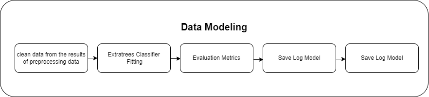
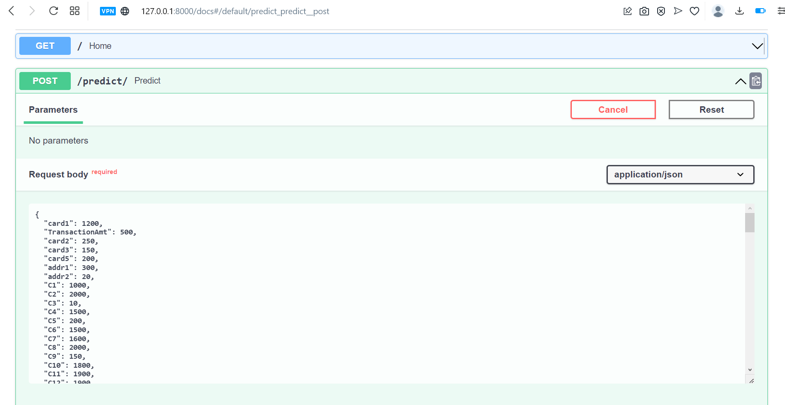

# IEEE-CIS Fraud Detection

## Business Problem

**_Fraud_** dalam transaksi daring menjadi masalah serius bagi perusahaan dan organisasi, karena dapat menyebabkan kerugian finansial yang signifikan. Oleh karena itu, penting bagi setiap perusahaan maupun organisasi untuk dapat mendeteksi sedini mungkin dan mencegah fraud seefektif mungkin.

**_Fraud Detection_** dalam transaksi daring menggunakan *Machine Learning* merupakan suatu pendekatan mutakhir dalam melawan ancaman *fraud* dalam lingkungan digital. Dengan pertumbuhan pesat transaksi daring, penting bagi perusahaan untuk memiliki sistem yang mampu mengidentifikasi dan mencegah transaksi yang mencurigakan.

## Business Objective

Objektif bisnis dari **IEEE-CIS Fraud Detection** adalah untuk adalah untuk membantu perusahaan dan organisasi mengidentifikasi transaksi yang berpotensi fraud sehingga perusahaan atau organisasi dapat mengurangi kerugian finansial yang disebabkan oleh aktivitas fraud. Dengan mempelajari pola-pola dari transaksi fraud yang terjadi sebelumnya, perusahaan dapat meningkatkan kebijakan keamanan dan sistem deteksi fraud. Selain itu, objektif bisnis dari program ini yakni perusahaan dapat menciptakan lingkungan transaksi daring yang lebih aman dan dapat dipercaya bagi pelanggan yang pada akhirnya meningkatkan nilai tambah bagi perusahaan. Setelah mempelajari berbagai macam data yang tersedia hal ini turut membantu perusahaan untuk secara efektif dalam meningkatkan efisiensi proses verifikasi hal ini akan meningkatkan efisiensi operasional perusahaan dan mengurangi biaya yang terkait dengan verifikasi transaksi.

## Business Metrics

`Tingkat Deteksi Fraud (Fraud Detection Rate)`: Meningkatkan persentase transaksi fraud yang berhasil diidentifikasi oleh sistem fraud detection. Metrics ini menunjukkan kemampuan sistem dalam mendeteksi transaksi-transaksi fraud yang sebenarnya.

## Machine Learning Solution

Machine Learning Solution yang dapat digunakan adalah mengembangkan model prediksi fraud menggunakan algoritma machine learning **Extratrees Classifier**. Dengan melakukan preprocessing data dan feature engineering terlebih dahulu, model Extratrees Classifier dapat digunakan untuk memprediksi kemungkinan terjadinya fraud pada transaksi keuangan.

Penting untuk terus memantau kinerja model dan melakukan evaluasi secara berkala untuk memastikan bahwa model tetap akurat dan dapat mengikuti perubahan pola fraud yang mungkin terjadi. Hal ini dapat dilakukan dengan menggunakan metrik evaluasi seperti akurasi, presisi, recall, dan AUC-ROC. Jika terdapat penurunan kinerja model, maka diperlukan perbaikan dan pembaruan model untuk menjaga efektivitasnya dalam mendeteksi fraud.

Dengan menerapkan Machine Learning Solution menggunakan Extratrees Classifier, perusahaan atau organisasi dapat secara proaktif mengidentifikasi dan mengurangi risiko fraud, melindungi aset mereka, serta meningkatkan kepercayaan customer.

## Machine Learning Metrics

Metrik **_Precision_** menghitung rasio True Positive dibandingkan dengan keseluruhan yang diprediksi positive. Hal ini menunjukkan bahwa metode yang digunakan akan fokus memperkecil nilai False Positive (FP) yang berarti mesti menaikkan threshold. Meningkatkan threshold juga dapat mengurangi jumlah True Positive (TP) dan meningkatkan jumlah False Negative (FN). Mengurangi jumlah False Positive (prediksi penipuan yang salah) sangat diperlukan untuk menghindari biaya dan kerugian yang tidak perlu akibat tindakan yang salah terhadap transaksi yang sebenarnya sah.

Namun, **_Recall_** sering kali menjadi metrik yang lebih penting. Hal ini karena tujuan utama dalam deteksi fraud adalah untuk mengidentifikasi sebanyak mungkin kasus penipuan yang sebenarnya. Jumlah False Negative (kasus penipuan yang terlewat) harus diminimalkan agar tidak kehilangan penipuan yang sebenarnya.

Penulis menetapkan metrik bisnis sebagai acuan project machine learning ini dibuat adalah **_Area Under Curve (AUC)_** hal ini dapat memberikan gambaran yang lebih holistik tentang kinerja model dalam deteksi fraud. Metrik-metrik ini mencoba untuk menyeimbangkan antara precision dan recall.

Namun pada eksplorasi kali ini `IEEE-CIS Fraud Detection` akan menampilkan beberapa metrics sebagai berikut:

 1.  **ROC-AUC**: Kurva Karakteristik Operasi Penerima (ROC) dan area dibawah kurva (AUC) digunakan untuk mengevaluasi kinerja model dengan menghitung rasio True Positive Rate (TPR) dan False Positive Rate (FPR). ROC-AUC memberikan nilai keseluruhan kinerja model dan digunakan untuk membandingkan beberapa model yang berbeda.
 2. **Accuracy**: metrik yang paling umum digunakan untuk mengukur seberapa akurat model dalam memprediksi kelas target. Accuracy dihitung sebagai rasio antara jumlah prediksi benar dengan jumlah total prediksi.
 3. **Precision**: metrik yang mengukur seberapa banyak dari kelas yang diprediksi sebagai positif yang benar-benar positif. Precision
dihitung sebagai rasio antara jumlah True Positives dengan jumlah
True Positives dan False Positives.
 4. **Recall**: metrik yang mengukur seberapa banyak dari kelas positif yang benar-benar terdeteksi oleh model. Recall dihitung sebagai rasio
antara jumlah True Positives dengan jumlah True Positives dan False
Negatives.
 5. **F1 Score**: merupakan harmonic mean dari Precision dan Recall. F1 score memberikan kesimbangan antara Precision dan Recall dan
digunakan untuk membandingkan kinerja model dengan metrik gabungan.

## Literature Review

1.  **A machine learning based credit card fraud detection using the GA algorithm for feature selection**

Makalah ini mengusulkan analisa kredit berbasis Machine Learning  (ML). Fraud Detection untuk kartu kredit menggunakan algoritma genetika (GA) untuk pemilihan fitur. Setelah fitur yang dioptimalkan, fitur akan dipilih, Fraud Detection yang diusulkan menggunakan metode machine learning classifier yakni: Decision Tree (DT), Random Forest (RF), Logistic Regression (LR), Artificial Neural Network (ANN), dan Naive Bayes (NB). Hasil menunjukkan bahwa DecisionTree memperoleh AUC 1 dan akurasi 100%. Disokong oleh Artificial Neural Network dengan AUC 0,94 dan akurasi 100%  (Ileberi et al., 2022)

2. **Fraud Detection in E-Commerce Using Machine Learning**

Penulis mengamati kuantitas fraud pada transaksi online meningkat. Pencegahan fraud dalam e-commerce akan dikembangkan menggunakan pembelajaran mesin, pekerjaan ini menganalisis algoritma machine learning yang cocok, algoritma yang akan digunakan adalah Decision Tree, Naïve Bayes, Random Forest, dan Neural Network. Data yang akan digunakan masih belum seimbang. Proses Synthetic Minority Over-sampling Technique (SMOTE) akan digunakan untuk membuat data keseimbangan. Hasil evaluasi dengan menggunakan matriks konfusi mendapatkan akurasi tertinggi dari neural network sebesar 96 persen, random forest sebesar 95 persen, Naïve Bayes sebesar 95 persen, dan Decision tree sebesar 91 persen. Synthetic Minority Over-sampling Technique (SMOTE) mampu meningkatkan rata-rata F1-Score dari 67,9 persen menjadi 94,5 persen dan rata-rata G-Mean dari 73,5 persen menjadi 84,6 persen. (Saputra, 2019)

3. **Fraud Detection on E-commerce Transactions Using Machine Learning Techniques**

Mendeteksi fraud dalam e-commerce adalah tugas menantang yang memerlukan penggunaan teknik canggih untuk mendeteksi transaksi penipuan. Keadaan terkini menunjukkan bahwa teknik machine learning menjanjikan untuk mendeteksi aktivitas fraud dalam transaksi e-commerce. Dalam studi ini, empat metode pembelajaran mesin yang berbeda (DecisionTree, LogisticRegression, Extreme Gradient Boosting, dan RandomForest). Kinerja model terbaik yaitu model LogisticRegression denga nilai F-measure 92%. (Gölyeri et al., 2023)

## Alur Transformasi Data

### Data Preparation

**Gambar Arsitektur Data Preparation**

### Data Definition
Data yang digunakan merupakan data yang menggambarkan identitas transaksi dan data transaksi yang memiliki label fraud dan tidak fraud. adapun fitur profile nasabah yang digunakan antara lain

Data berisi 590540 rows × 434 columns yaitu :

* TransactionID: ID unik untuk setiap transaksi.
* isFraud: Variabel target yang menandakan apakah transaksi tersebut merupakan fraud (penipuan) atau tidak fraud (penipuan).
* TransactionDT: Waktu transaksi dalam satuan detik sejak waktu awal (referensi).
* TransactionAmt: Jumlah transaksi dalam mata uang asli.
* ProductCD: Jenis produk yang digunakan dalam transaksi.
* card1 - card6: Informasi terkait kartu kredit seperti jenis, kategori, dan penerbit.
* addr1 - addr2: Informasi terkait alamat pelanggan.
* P_emaildomain dan R_emaildomain: Domain email pelanggan yang terkait dengan transaksi pengirim (P) atau penerima (R).
* C1 - C14: Fitur perhitungan yang berhubungan dengan kartu kredit.
* D1 - D15: Fitur perhitungan yang mencerminkan waktu antara transaksi.
* M1 - M9: Fitur kategorikal yang mengindikasikan kecocokan antara nama di kartu, alamat, dan alamat email.
* V1 - V339: Fitur-fitur yang dihasilkan oleh PCA dan berisi informasi terkait dengan transaksi.
* TransactionID: ID unik untuk setiap transaksi.
* id-01 hingga id-38: Fitur-fitur identitas yang mengandung informasi terkait dengan profil identitas pelanggan.
* DeviceType: Jenis perangkat yang digunakan oleh pelanggan saat melakukan transaksi.
* DeviceInfo: Informasi terkait dengan perangkat yang digunakan oleh pelanggan saat melakukan transaksi.
* id_12 - id_38: Fitur-fitur identitas tambahan yang memberikan informasi tambahan tentang profil identitas pelanggan.

## Exploratory Data Analysis (EDA) 

** Gambar Arsitektur Exploratory Data Analysis (EDA) **

### Data Preprocessing

** Gambar Data Preprocessing ***

### Data Modeling

**Gambar Arsitektur Data Modeling**

Extratrees Classifier, juga dikenal sebagai Extremely Randomized Trees, adalah sebuah algoritma machine learning yang termasuk ke dalam keluarga algoritma Decision Trees. Extratrees Classifier merupakan modifikasi dari algoritma Random Forest, yang menggabungkan konsep ensemble learning dan pengambilan keputusan berdasarkan voting mayoritas dari beberapa pohon keputusan (decision tree).

Pada Extratrees Classifier, proses pembangunan pohon keputusan dilakukan dengan beberapa perbedaan dibandingkan dengan algoritma Decision Trees tradisional atau Random Forest. Berikut adalah beberapa karakteristik dan rumus matematis yang digunakan dalam Extratrees Classifier:

1.  Pembentukan Decision Tree:
    
    -   Setiap pohon keputusan dibangun dengan membagi data ke dalam node-node berdasarkan kondisi pada fitur-fitur yang ada.
    -   Pembagian node dilakukan secara acak, tidak seperti dalam Random Forest yang menggunakan metode pembagian terbaik (best split) berdasarkan gini impurity atau entropy.
    -   Jumlah fitur yang digunakan untuk pembagian node juga bersifat acak, tidak selalu menggunakan seluruh fitur yang tersedia.
2.  Voting Mayoritas:
    
    -   Setelah semua pohon keputusan dibangun, hasil prediksi dari setiap pohon keputusan digabungkan dengan menggunakan voting mayoritas.
    -   Kelas yang mendapatkan suara terbanyak akan menjadi prediksi akhir dari model.
3.  Rumus Matematis:
    
    -   Extratrees Classifier menggunakan beberapa rumus matematis yang mirip dengan Random Forest.
    -   Loss function yang umum digunakan pada Extratrees Classifier adalah mean squared error (MSE) untuk tugas regresi dan Gini Index atau Cross-Entropy untuk tugas klasifikasi.
    -   Rumus Gini Index: Gini Index = 1 - (p1^2 + p2^2 + ... + pk^2) di mana p1, p2, ..., pk adalah proporsi kelas yang ada pada node tersebut.
    -   Rumus Cross-Entropy: Cross-Entropy = - (p1 * log(p1) + p2 * log(p2) + ... + pk * log(pk)) di mana p1, p2, ..., pk adalah probabilitas kelas yang ada pada node tersebut.

Extratrees Classifier menggabungkan keunggulan ensemble learning dari Random Forest dengan variasi pembentukan pohon keputusan yang lebih acak. Hal ini dapat menghasilkan model yang lebih variatif dan robust terhadap overfitting. Dengan menggunakan voting mayoritas, Extratrees Classifier dapat membuat keputusan yang lebih stabil dan dapat meningkatkan kinerja prediksi pada berbagai tugas seperti klasifikasi dan regresi.

### Evaluation Metrics

Hasil pemodelan dengan menggunakan  Extratrees Classifier ialah sebagai berikut dan skor accuracy yang dihasilkan pada data valid dan test dirasa cukup baik.

Validation accuracy: 0.9782967614478233
Test accuracy: 0.9782496213439702

dan berikut hasil dari classification report dari pemodelan diatas

Berdasarkan hasil Classification report diatas Recall pada classification report merupakan salah satu metrik evaluasi klasifikasi yang mengukur seberapa baik model dalam mengidentifikasi kelas positif atau kelas minoritas. Pada laporan di atas, recall untuk kelas 0 adalah 0.99 dan recall untuk kelas 1 adalah 0.49. Lalu, precision untuk kelas 0 adalah 0.98 dan precision untuk kelas 1 adalah 0.815.

dan berikut hasil ROC dan AUC model Extratrees Classifier yang digunakan untuk pemodelan kali ini

AUC (Area Under the Curve) adalah metrik evaluasi yang digunakan untuk mengukur kinerja model klasifikasi biner. Nilai AUC menunjukkan seberapa baik model dapat membedakan antara kelas positif dan negatif.

AUC memiliki rentang nilai antara 0 hingga 1, dimana semakin tinggi nilai AUC, semakin baik kinerja model dalam membedakan antara kelas positif dan negatif. Dalam kasus ini, nilai AUC sebesar AUC: 0.90 menunjukkan bahwa model memiliki kinerja yang baik dalam membedakan antara kelas positif dan negatif.

## Machine Learning Services

** Arsitektur Machine Learning Services **

Selanjutnya, setelah melalui beberapa proses dan model telah di save akan dilanjutkan pada deployment dengan menggunakan API dan Streamlit gambar dibawah ini merupakan contoh mengakses menggunakan ML Services melalui FAST API Swagger UI.

Berikut contoh input data yang digunakan untuk mengakses API

 

Berikut hasil output prediksi dari API services:

## Kesimpulan

1. Model machine learning dengan menggunakan Extratrees sudah cukup memberikan hasil yang cukup baik dalam pemodelan dibuktikan dengan nilai Validation accuracy: 0.9782967614478233, Test accuracy: 0.9782496213439702 dan recall untuk kelas 0 adalah 0.99 dan recall untuk kelas 1 adalah 0.49. Lalu, precision untuk kelas 0 adalah 0.98 dan precision untuk kelas 1 adalah 0.815 Dalam kasus ini, nilai AUC sebesar 0.90 menunjukkan bahwa model memiliki kinerja yang baik dalam membedakan antara kelas positif dan negatif hal ini sesuai dengan machine learning metrics yang sudah didefinisikan.

## Future Works

1. lebih banyak variabel identity yang tidak bernilai nan dan baiknya ada diskusi lebih lanjut mengenai keterisian data yang bernilai nan tersebut agar pembuatan model jauh lebih baik dan akurat.
2. Mencoba menggunakan metode lain dan terbaru untuk improvisasi kualitas model.

## Referensi

- Gölyeri, M., Çelik, S., Bozyiğit, F., & Kılınç, D. (2023). Fraud detection on e-commerce transactions using machine learning techniques. In _Artificial Intelligence Theory and Applications_ (Vol. 3, Issue 1). https://www.boyner.com.tr/

- Ileberi, E., Sun, Y., & Wang, Z. (2022). A machine learning based credit card fraud detection using the GA algorithm for feature selection. _Journal of Big Data_, _9_(1). https://doi.org/10.1186/s40537-022-00573-8

- Saputra, A. (2019). Fraud Detection using Machine Learning in e-Commerce. In _IJACSA) International Journal of Advanced Computer Science and Applications_ (Vol. 10, Issue 9). www.ijacsa.thesai.org

- https://towardsdatascience.com/step-by-step-approach-to-build-your-machine-learning-api-using-fast-api-21bd32f2bbdb

- https://engineering.rappi.com/using-fastapi-to-deploy-machine-learning-models-cd5ed7219ea

- https://towardsdatascience.com/what-when-how-extratrees-classifier-c939f905851c
